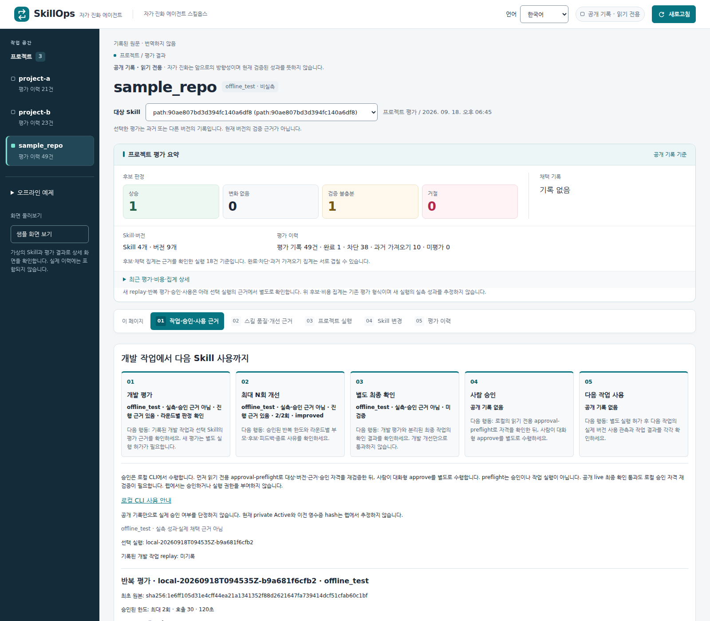

# Self-Evolving Agent SkillOps

[English](README.md) | [한국어](README.ko.md)

**실행 근거를 바탕으로 에이전트의 Skill을 발전시키는 자가 진화 루프**

코드에는 CI/CD가 있습니다. 에이전트의 행동 지침에도 통제된 개선 과정이 필요합니다.
SkillOps는 관측된 문제를 지침 변경 후보로 만들고 평가하며,
실제 채택은 사람이 통제하도록 합니다.

진화의 대상은 모델 가중치가 아니라 **Skill·행동 지침**입니다.
**Skill CI/CD는 이러한 진화를 검증하고 통제하는 기반**이며,
승인 없이 지침을 덮어쓰거나 배포해도 된다는 뜻이 아닙니다.

## 대시보드 화면



*2026년 9월 21일 실제 UI 캡처입니다. 선택된 과거 `offline_test` 예제는 흐름을 보여줄
뿐 실측 모델 개선, 현재 버전 검증 또는 실제 승인을 입증하지 않습니다.
프로젝트 전체 요약 집계와 선택한 실행의 근거는 서로 다른 범위입니다.
직접 접속 링크 대신 정적인 화면을 제공합니다.*

읽기 전용 대시보드는 영어와 한국어를 지원합니다. 저장된 문제·후보·평가·채택 관측을
연결해 보여주며, 없는 결과를 만들어내지 않습니다. Skill 원문과 기록된 근거는 번역하지 않습니다.
실제 실행과 승인은 웹이 아니라 로컬 CLI에서 수행합니다.

## 왜 SkillOps인가?

에이전트가 작업을 완료해도 어떤 지침이 도움이 됐는지, 무엇이 잘못됐는지,
수정안이 다른 작업을 망가뜨리지는 않을지 알기 어려울 수 있습니다.
Skill을 편집하는 일보다 그 변경을 채택해도 되는지 입증하는 일이 더 어렵습니다.

SkillOps는 변경 과정을 확인할 수 있게 합니다.

- **무슨 일이 있었는가?** 관측된 문제와 당시 평가 맥락을 보존합니다.
- **무엇을 바꿀 것인가?** 개선 가설과 버전이 식별되는 Skill 후보를 기록합니다.
- **도움이 됐는가?** 근거를 비교하고 회귀와 미검증 항목을 구분합니다.
- **다음은 무엇인가?** 거절·최종 확인·사람 승인·실제 사용을 별도로 추적합니다.

거절된 후보도 유용한 결과입니다. 점수가 올랐다는 사실만으로 업무 성과 향상,
후보 채택 권한 또는 다음 작업 사용이 입증되지는 않습니다.

## 진화 루프는 어떻게 동작하는가?

```text
작업·평가 근거
  → 관측된 문제
  → 개선 가설
  → 버전이 식별되는 Skill 후보
  → 재평가와 지원되는 회귀 검사
  → 별도의 최종 확인 — 설정된 경우
  → 로컬 CLI에서 사람 승인
  → 별도로 실행을 승인한 다음 작업
  → 새로운 실행 근거

사용자 피드백 ── 입력·연결 예정 ──> 개선 가설
```

이는 제품의 전체 흐름이며, **모든 단계가 하나의 성공적인 실제 운영 사이클로
실증됐다는 뜻은 아닙니다.** 각 단계에는 별도의 근거와 권한이 필요하고,
앞 단계가 완료됐다는 이유만으로 다음 단계가 자동 진행되지는 않습니다.
다음 작업 결과를 후속 개선의 입력으로 자동 재사용하는 연결은 후속 작업입니다.

Skill은 `.github/skills`, `.claude/skills`, `skills` 및 그 하위 경로에서 탐지하는 묶음입니다.
버전은 파일 이름뿐 아니라 묶음의 내용을 식별합니다. 현재 후보 생성은
frontmatter와 부속 파일을 보존하면서 `SKILL.md` 본문을 변경합니다.

자동 프로젝트 평가 경로는 평가 가능한 Skill마다 후보를 최대 하나 생성합니다.
별도로 선택하는 기록된 작업 경로는 부모·후보 계보, 피드백 참조, 중단 이유,
선택적인 독립 최종 확인을 포함한 제한된 개발 반복을 지원합니다.
두 경로는 서로 다르며, 제한 없이 자동으로 자기 개선을 계속하는 하나의 과정이 아닙니다.

## 현재 가능한 것과 계획된 것

| 기능 | 현재 범위 |
| --- | --- |
| Skill 탐지·버전 관리 | 묶음을 탐지하고 식별자·원문 캡처·과거 근거를 보존합니다. |
| 후보 생성·평가 | 지침 변경을 제안하고 품질을 평가하며 지원되는 프로젝트 검사를 실행합니다. 미지원 영역은 미검증으로 남깁니다. |
| 제한된 반복 개선 | 명시적인 반복·실행 한도 안에서 개발 피드백을 재사용하고 시도·중단 이유를 기록합니다. |
| 별도 최종 확인 | 사전 등록 작업과 검토된 독립성 공개 정보를 사용하는 선택적 경로입니다. 격리를 지원하지 않으면 자격 부여를 차단합니다. |
| 사람 승인·다음 사용 | 적격한 live 근거, 정확한 버전, 명시적 권한을 요구하는 별도 로컬 명령입니다. 구현됐다는 사실이 특정 후보의 승인·사용 실적을 뜻하지는 않습니다. |
| 대시보드 | 읽기 전용 근거 조회, 버전·diff 이력, 영어·한국어 UI를 제공합니다. 웹 승인 버튼은 없습니다. |
| 사용자 피드백 | 수집, 적용 범위·충돌 검토, 채택 여부 및 버전별 효과 추적은 계획 단계입니다. |
| 다음 사용 결과의 자동 재입력 | 작업 결과와 사용자 피드백을 후속 개선으로 자동 연결하는 기능은 계획 단계입니다. 결과를 저장했다고 연결이 완성되는 것은 아닙니다. |
| GEPA 통합 | 개념적 참고입니다. GEPA의 Pareto 기반 후보군 탐색은 구현되지 않았습니다. |
| Canary·자동 승격·롤백 | 구현되지 않았습니다. |

### 무엇을 검증했다는 뜻인가?

다음은 서로 다른 질문이며, 하나의 통과 표시로 대체할 수 없습니다.

| 근거 | 입증하는 것과 입증하지 않는 것 |
| --- | --- |
| 지침 품질 | Skill이 더 명확하거나 근거가 충분한지 평가합니다. 실제 작업 성공은 아닙니다. |
| 개발 평가 | 기록된 개발 작업에서 후보가 어떻게 동작했는지 보여줍니다. 독립 최종 확인은 아닙니다. |
| 독립 최종 확인 | 선택된 후보를 별도 최종 작업으로 확인합니다. 사람 승인은 아닙니다. |
| 사람 승인 | 정확한 후보와 연결된 근거에 대한 권한입니다. 배포나 다음 작업 실행은 아닙니다. |
| 버전 사용 관측 | 승인된 버전을 사용했는지 확인합니다. 그 작업의 성공을 뜻하지는 않습니다. |

알 수 없는 측정값은 그대로 남깁니다. 과거 평가는 당시의 소스·평가기 식별자를 유지합니다.
오프라인 예제가 live 근거로 바뀌지는 않습니다.
저장소 CI는 SkillOps 자체를 검사하며, 새로운 모델 개선 평가를 실행한 결과가 아닙니다.

## 실제 기록 사례: 후보를 거절한 이유

2026년 9월 15일의 과거 쌍대 비교에서는 기존 Skill과 후보 모두 작업 검사를 통과했습니다.
그러나 후보는 품질 향상이 없었고, 기록된 개발자·판정 모델의 합산 비용은 **1.64%**,
작업 소요 시간은 **2.32% 증가**했습니다.
요구된 개선 기준을 충족하지 못해 **거절**했으며, 기존 Skill을 유지하고 후보를 배포하지 않았습니다.

이는 다섯 작업으로 구성된 작은 비교 한 번의 결과입니다. 통계적인 성능 악화나 현재 평가기의
유효성을 입증하지 않으며, 수치에는 후보 생성·교정 비용이 포함되지 않습니다.
[당시 결과와 한계](docs/OPERATIONS.ko.md#첫-실제-후보-결과)를 확인할 수 있습니다.

핵심은 모든 시도가 에이전트를 개선한다는 것이 아닙니다.
변경을 채택하거나 거절하거나 추가 조사해야 하는 이유를 보존하는 것입니다.

## 설계 참고: GEPA와 현재 구현 범위

[GEPA](https://arxiv.org/abs/2507.19457)는 실행 기록과 텍스트 피드백을 성찰해
프롬프트 변경을 제안·평가하고, 서로 다른 작업 예제에서 상호 보완적인 강점을 가진
후보를 유지하는 프롬프트 진화 접근을 다룹니다.

SkillOps에서 연결해 설명하는 공통 흐름은 다음과 같습니다.

**근거 → 가설 → 지침 변경 → 재평가**

현재 구현과 상세 계약은 APO-inspired 개선 근거를 설명합니다.
이 개념적 비교가 기존 구현을 교체하거나 GEPA 전체 통합을 뜻하지는 않습니다.
Pareto 기반 후보군 탐색은 구현 범위 밖입니다.
SkillOps는 여기에 최종 확인·사람 승인·버전 사용·게시 사이의 명시적인 통제 경계를 둡니다.

지침 품질 평가는 Anthropic의 Skill 작성 가이드도 참고합니다.
이는 자동화된 참고 평가이며, 인증이나 실제 작업 평가의 대체물 또는 후보 채택 권한이 아닙니다.

## 안전하게 시작하기

아래 명령은 저장소 루트에서 실행합니다.
먼저 **인증이나 모델 호출 없이 로컬 정보를 확인**합니다.

```bash
python3 -m venv .venv
. .venv/bin/activate
python3 -m pip --isolated install --disable-pip-version-check \
  --only-binary=:all: --require-hashes --index-url https://pypi.org/simple \
  -r skillops/requirements-evaluator.txt
python3 skillops/skillops.py --help
python3 skillops/project_results.py catalog
```

의존성 설치는 패키지 인덱스에 접근하지만, 위 조회 명령은 모델을 실행하지 않습니다.
평가기 실행 환경은 Linux와 Python 3.12 이상입니다.
실제 모델 실행에는 인증된 Copilot CLI, Docker와 별도로 승인된 호출·시간·Credit 한도가 필요합니다.

화면을 보기 위해 live 평가를 켜지 마세요.
[오프라인 발표 가이드](docs/OPERATIONS.ko.md#오프라인-발표-백업)에서 유료 모델 호출 없이
출처가 명확한 로컬 예제를 만드는 방법을 확인할 수 있습니다.
생성된 지침과 비공개 실행 데이터는 기본적으로 공개 대상이 아닙니다.

### 별도의 로컬 승인

**대시보드에는 승인 버튼이 없습니다.**

1. 정확한 후보와 근거를 대상으로 로컬 읽기 전용 `approval-preflight`를 실행합니다.
2. 적격하면 반환된 승인 명령을 검토하고 본인이 대화형 터미널에서 실행합니다.
3. 전체 후보 버전을 확인합니다. 승인만으로 Active를 바꾸거나 모델을 호출하지 않습니다.
4. 필요한 경우 새로운 작업에 별도 `run-approved` 실행을 승인합니다.

개발 평가만 있는 결과와 오프라인 결과는 승인할 수 없습니다.
Live 사이클은 별도 최종 확인을 통과하고 현재 코드·평가기·로컬 상태와 일치해야 합니다.
Preflight 출력에는 비공개 로컬 정보가 포함되므로 공개 로그·스크린샷·영상에 복사하지 마세요.

[정확한 승인 명령과 안전장치](docs/OPERATIONS.ko.md#별도의-로컬-승인) ·
[다음 작업 실행](docs/OPERATIONS.ko.md#별도로-실행-승인한-다음-작업)

## 저장소 구조

```text
skillops/                 앱, CLI, 대시보드, 테스트, 의존성
projects/                 준비된 프로젝트 스냅샷
results/                  저장된 평가 기록
eval/ 및 skills/          보호된 벤치마크 입력과 초기 Skill
evidence/                 과거 평가 근거
publication-candidates/   검토된 게시 입력
docs/                     운영 가이드와 계약
```

비공개 `.skillops/`, `.skillops-private/`, `runs/` 디렉터리는 공개 산출물이 아닙니다.
명시적인 상대 CLI 경로는 명령을 실행하는 작업 디렉터리를 기준으로 해석합니다.
[명령과 경로 규칙](docs/OPERATIONS.ko.md#저장소-구조와-실행-경로)을 참고하세요.

## 문서와 기여

| 필요한 내용 | 안내 |
| --- | --- |
| 상세 명령과 과거 측정값 | [운영 가이드](docs/OPERATIONS.ko.md) |
| 프로젝트 평가·형식·실행 경계 | [프로젝트 평가](docs/PROJECT-EVALUATION.md) |
| Replay·반복·최종 확인·승인 계약 | [계약](docs/HACKATHON-CONTRACTS.md) |
| 평가 없이 검토된 기록만 게시 | [검토 결과 게시](docs/REVIEWED-PUBLICATION.md) |
| 과거 벤치마크 근거 | [평가 기록](evidence/README.ko.md) |
| 계획 배경 — 현재 완료 목록이 아님 | [작성 시점의 로드맵](docs/ROADMAP.md) |
| 개발 흐름과 기여 방법 | [기여 가이드](CONTRIBUTING.md) |

기능 브랜치와 PR로 변경을 제안하세요.
근거를 보존하고 구현된 기능, 측정한 결과, 가설과 계획을 구분합니다.
