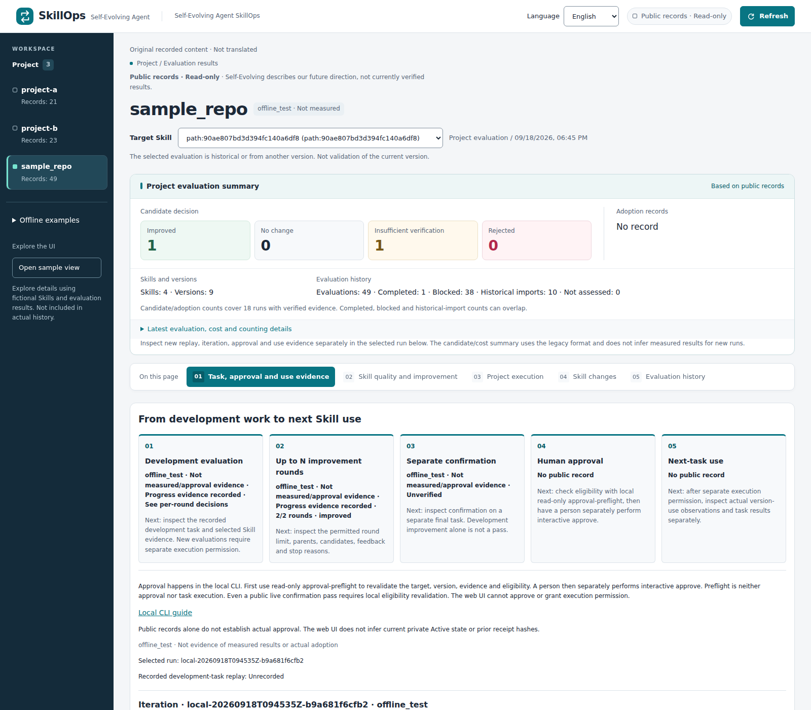

# Self-Evolving Agent SkillOps

[English](README.md) | [한국어](README.ko.md)

**An evidence-driven evolution loop for agent skills.**

Code has CI/CD. Agent instructions need a controlled improvement process too.
SkillOps turns observed problems into proposed instruction changes, evaluates
candidates, and keeps adoption under human control.

The evolving artifact is the agent's **Skill and behavioral instructions**, not
its model weights. **Skill CI/CD is the verification and control layer for that
evolution**—not permission to rewrite or deploy instructions without approval.

## Dashboard preview



*Actual UI capture, September 21, 2026. The selected historical `offline_test`
example demonstrates the flow, not measured model improvement, current-version
validation or actual approval. Project-wide summary counts and selected-run
evidence have different scopes. This is a static screenshot, not a live link.*

The read-only dashboard supports English and Korean. It connects saved
problems, candidates, evaluations and adoption observations without inventing
missing results. Original Skill text and recorded evidence are not translated.
Execution and approval happen through the local CLI, not the web interface.

## Why SkillOps?

An agent can complete a task without revealing why its instructions helped,
what went wrong, or whether a proposed fix will break another task.
Editing a Skill is easy; establishing that it should be adopted is harder.

SkillOps makes the change inspectable:

- **What happened?** Preserve the observed problem and its evaluation context.
- **What should change?** Record a hypothesis and a versioned Skill candidate.
- **Did it help?** Compare evidence, check regressions and distinguish missing checks.
- **What happens next?** Keep rejection, confirmation, human approval and actual use separate.

A rejected candidate is a useful result. A higher score alone is not proof of
better work, authorization to adopt a candidate, or evidence of its next use.

## How the evolution loop works

```text
Task / evaluation evidence
  -> Observed problem
  -> Improvement hypothesis
  -> Versioned Skill candidate
  -> Re-evaluation and supported regression checks
  -> Separate final confirmation, when configured
  -> Human approval in the local CLI
  -> Separately authorized next task
  -> New execution evidence

User feedback ── planned input and linkage ──> Improvement hypothesis
```

This is the product's lifecycle, **not a claim that every stage has been
demonstrated in one successful live operational cycle**. Stages require their
own evidence and permissions; they do not advance merely because a previous
stage completed. Automatic reuse of next-task results as the next improvement
input remains follow-up work.

A Skill is a bundle discovered under `.github/skills`, `.claude/skills` or
`skills`, including nested directories. A version identifies the bundle's
contents, not just its filename. Candidate generation currently changes the
`SKILL.md` body while preserving frontmatter and supporting files.

The automatic project path generates at most one candidate per eligible Skill.
The opt-in recorded-work path supports bounded development iterations with
parent/candidate lineage, feedback references, stop reasons and optional
separate confirmation. These are different execution paths, not one implicit
unlimited self-improvement process.

## What works today—and what remains planned

| Capability | Current scope |
| --- | --- |
| Skill discovery and versioning | Detect bundles and preserve identities, source captures and historical evidence. |
| Candidate generation and evaluation | Generate proposed changes, assess instruction quality and run supported project checks. Missing support remains unverified. |
| Bounded iteration | Reuse development feedback within explicit round and execution limits; retain attempts and stop reasons. |
| Separate confirmation | An opt-in path uses a preregistered work item and reviewed independence disclosure. Unsupported isolation blocks qualification. |
| Human approval and next use | Separate local commands require eligible live evidence, exact versions and explicit authorization. Implementation is not proof that a particular candidate was approved or used. |
| Dashboard | Read-only evidence views, version/diff history and English/Korean UI. No web approval button. |
| User feedback | Collection, scope/conflict review, disposition and version-linked effect tracking are planned. |
| Automatic learning from next use | End-to-end reinjection of task results and user feedback is planned, not assumed from a stored result. |
| GEPA integration | Conceptual reference only; GEPA's Pareto candidate-pool search is not implemented. |
| Canary, automatic promotion and rollback | Not implemented. |

### What “verified” means

These are separate questions, not interchangeable green badges:

| Evidence | What it does—and does not—establish |
| --- | --- |
| Instruction quality | Whether a Skill is clearer or better grounded; not actual task success. |
| Development evaluation | How the candidate performed on the recorded development work; not independent final confirmation. |
| Independent confirmation | A separate final check for the selected candidate; not human approval. |
| Human approval | Permission for the exact candidate under its evidence binding; not deployment or next-task execution. |
| Version-use observation | Whether the approved version was used; not whether the task succeeded. |

Unknown measurements stay unknown. Historical evaluations retain their original
source/evaluator identities. Offline examples do not become live evidence.
Repository CI validates SkillOps itself; it is not a fresh model-improvement run.

## One recorded outcome: a candidate was rejected

In a historical September 15, 2026 paired benchmark, the original and candidate
both passed the task checks. The candidate showed no quality gain; its recorded
developer-plus-judge cost was **1.64% higher** and task elapsed time **2.32% higher**.
It failed the required improvement threshold, so the decision was **rejected**.
The original Skill remained unchanged and the candidate was not deployed.

This was one small five-task comparison, not statistical evidence of degradation
or validation of the current evaluator. The figures exclude candidate generation
and calibration. [Read the recorded outcome and its limitations](docs/OPERATIONS.md#first-actual-candidate-outcome).

The point is not that every attempt improves an agent. It is that the system
retains the reason to accept, reject or investigate a proposed change.

## Design inspiration: GEPA and implementation scope

[GEPA](https://arxiv.org/abs/2507.19457) explores reflective prompt evolution:
use execution traces and textual feedback to propose changes, evaluate them,
and retain candidates with complementary strengths across task examples.

The shared pattern we highlight in SkillOps is:

**Evidence → hypothesis → instruction change → re-evaluation.**

The current implementation and detailed contracts describe APO-inspired
improvement evidence; this conceptual comparison does not replace that
implementation or claim full GEPA integration. Pareto-based candidate-pool
search remains outside the implemented scope. SkillOps adds explicit lifecycle
boundaries around confirmation, approval, version use and publication.

Instruction-quality assessment also draws on Anthropic's Skill-authoring
guidance. It is automated guidance—not certification, a substitute for task
evaluation, or permission to adopt a candidate.

## Try it safely

Commands below run from the repository root. Start with **local inspection,
without authentication or model calls**:

```bash
python3 -m venv .venv
. .venv/bin/activate
python3 -m pip --isolated install --disable-pip-version-check \
  --only-binary=:all: --require-hashes --index-url https://pypi.org/simple \
  -r skillops/requirements-evaluator.txt
python3 skillops/skillops.py --help
python3 skillops/project_results.py catalog
```

The dependency installation accesses the package index; these inspection
commands do not run a model. Evaluator work targets Linux and Python 3.12+.
Live execution additionally needs an authenticated Copilot CLI, Docker and
explicitly authorized invocation/time/Credit limits.

Do not turn on live evaluation just to view the UI. See the
[offline presentation guide](docs/OPERATIONS.md#offline-presentation-backup)
for producing a local, clearly labeled example without paid model calls.
Generated instructions and private runtime data must not be published by default.

### Separate local approval

There is **no approval button on the dashboard**.

1. Run local read-only `approval-preflight` against an exact candidate and its evidence.
2. If eligible, review the returned approval command and execute it yourself in an interactive terminal.
3. Confirm the complete candidate version. Approval alone does not change Active or call a model.
4. Authorize a separate `run-approved` invocation for a new task when appropriate.

Development-only and offline results are not approvable. A live cycle must pass
separate confirmation and match the current code/evaluator and local state.
Preflight output contains private local information; do not paste it into public
logs, screenshots or videos.

[Exact approval commands and safeguards](docs/OPERATIONS.md#separate-local-approval) ·
[Next-task execution](docs/OPERATIONS.md#separately-authorized-next-execution)

## Repository layout

```text
skillops/                 Application, CLI, dashboard, tests and dependencies
projects/                 Prepared project snapshots
results/                  Stored evaluation records
eval/ and skills/         Protected benchmark inputs and seed Skills
evidence/                 Historical evidence
publication-candidates/   Reviewed publication inputs
docs/                     Operating guides and contracts
```

Private `.skillops/`, `.skillops-private/` and `runs/` directories are not public
artifacts. Explicit relative CLI arguments resolve from the caller's working
directory. See [command and path rules](docs/OPERATIONS.md#repository-layout-and-commands).

## Documentation and contributing

| Need | Guide |
| --- | --- |
| Detailed commands and historical measurements | [Operating guide](docs/OPERATIONS.md) |
| Project evaluation, formats and execution boundaries | [Project evaluation](docs/PROJECT-EVALUATION.md) |
| Replay, iteration, confirmation and approval contracts | [Contracts](docs/HACKATHON-CONTRACTS.md) |
| Publishing reviewed records without evaluation | [Reviewed publication](docs/REVIEWED-PUBLICATION.md) |
| Historical benchmark evidence | [Evidence](evidence/README.md) |
| Planning background—not a current completion checklist | [Dated roadmap](docs/ROADMAP.md) |
| Development workflow and contributions | [Contributing](CONTRIBUTING.md) |

Propose changes through a feature branch and PR. Preserve evidence and distinguish
what is implemented, what was measured, and what remains a hypothesis or plan.
